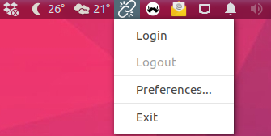
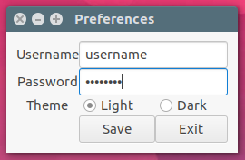

# iitb-internet-login
App Indicator to login into internet.iitb.ac.in for Linux Systems

Start the indicator using ```./appindicator & ```

It will check the login status and display the login indicator in the panel.



If you are starting it for the first time, you'll see the Preferences dialog box where you can enter your username and password. You can change it again using the indicator menu.



On login, ```libnotify``` will alert you that you have logged in.


Similarly for logout.


